# Team-GPT 对比 ChatGPT Teams：营销团队该选谁?【2025版】

---

如果你的营销团队正在尝试用 AI 来做内容、研究或者规划,大概率已经听说过 ChatGPT Teams 和 Team-GPT。虽然两个工具都基于 ChatGPT,但在协作方式、内容共享和团队工作流上,差异还挺大的。

这篇文章会从营销团队真正关心的点出发——比如提示词的可见性、内容版本管理、用户权限控制、团队访问方式——来对比这两个工具。如果你正在纠结选哪个,希望这篇能帮到你。

---

## 先说结论

- **Team-GPT** 更适合需要共享提示词库、版本控制、数据分析、多模型接入和更透明工作流的营销团队。
- **ChatGPT Teams** 适合喜欢开箱即用、持久化对话记录、内置 GPTs 和深度集成 OpenAI 工具生态的团队。

---

## 相似之处:两者都能做什么

Team-GPT 和 ChatGPT Teams 都能帮营销团队提速。虽然各有侧重,但核心功能上还是有不少共同点:

### 支持先进模型

两个平台都能用最新的 GPT 版本,包括 GPT-4o。你也可以构建和部署自己的 GPTs(按特定指令训练的定制版本),用来处理文案、测试活动或者分析受众。

### 团队管理和权限控制

都支持基于团队的工作空间,可以设置角色权限。你可以添加或移除成员、分配管理员角色,还能限制敏感提示词或项目文件夹的访问权限。

### 协作功能

无论是做活动文案、客户分群,还是头脑风暴邮件开头,两个工具都支持共享文件夹和对话。团队成员可以查看项目历史,接着别人的工作继续推进,实时协作修改草稿。

### 内置 DALL·E 3 图片生成

如果团队需要做广告视觉或者内容横幅,两个平台都能直接在对话里用 DALL·E 3 生成图片。不用跳出去找其他工具。

### 品牌一致性的自定义指令

通过自定义指令,你可以定义语调、写作风格和品牌规则。这样不同成员用 AI 输出的内容,风格都能保持统一。

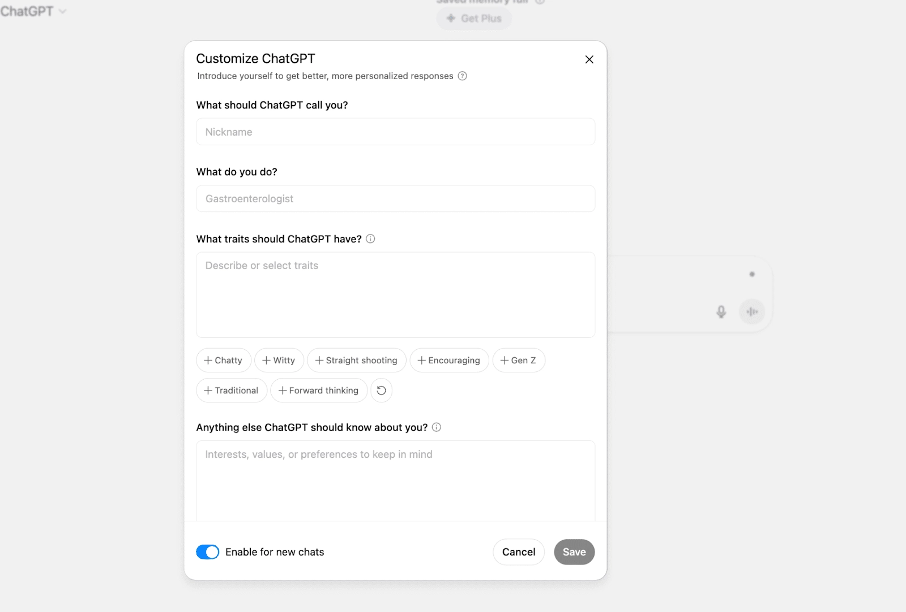

### 企业级安全

两个平台都遵循企业级安全协议,包括 SOC2 合规(严格的数据处理和安全规则)、SSO(单点登录)和加密云部署。处理客户或活动数据时不用担心隐私问题。

---

## 功能对比:谁更适合你

如果你在为团队选 AI 工具(不是个人用),Team-GPT 和 ChatGPT Teams 是两个最相关的选项。虽然表面看着差不多,但在协作方式、提示词控制和工作空间结构上,差别挺明显。

一个是为 AI 透明度和共享工作流设计的,另一个更倾向简洁和深度融入 OpenAI 生态。

### 快速对比

- **Team-GPT** 适合需要结构化提示词工作流、共享工作空间、多模型支持、提示词版本控制和高级品牌定制的团队。
- **ChatGPT Teams** 适合想要开箱即用、持久化对话历史、内置 GPTs 和无缝集成 OpenAI 工具的团队。

| 功能 | Team-GPT | ChatGPT Teams |
|------|----------|---------------|
| 提示词定制 | 结构化提示词构建器,支持后续问题优化输出 | 基础输入式提示 |
| AI 模型灵活性 | 支持 GPT-4o、Claude、Gemini | 仅支持 OpenAI 模型(GPT-3.5、GPT-4o)|
| 输出编辑 | 类文档的页面编辑、优化和保存 | 无文档编辑器,仅对话界面 |
| 图片生成 | 支持 DALL·E 3 | 支持 DALL·E 3 |
| 自定义指令 | 可保存品牌语调、格式或风格为可复用指令 | 每用户限一条自定义指令 |
| 分析和使用追踪 | 按用户、项目或模型的高级使用报告 | 无使用分析或团队洞察 |
| 团队协作 | 实时提示词共创、共享文件夹、可复用提示词库 | 仅共享文件夹和历史,无实时提示词构建 |
| 安全和管理控制 | 企业级安全、SSO、自定义模型、私有云选项 | 基础工作空间管理和角色访问 |
| 平台限制 | 仅在 Team-GPT 内使用 | 可用于网页、桌面和移动应用 |

接下来详细说说这些功能 👇

---

## Team-GPT 的核心功能

Team-GPT 是为需要可重复、结构化工作流的营销团队设计的。你可以构建和存储提示词模板,分配给活动,追踪不同成员的使用情况。

### 功能 1:打造符合品牌的营销工作空间

Team-GPT 让你控制团队如何使用 AI 工具。你可以集成多个 AI 模型(比如 GPT-4o、Claude、Gemini,甚至你自己的定制模型),不会被锁在一个供应商上。功能包括:

- 针对活动、SEO、邮件或付费广告的结构化提示词模板
- 可复用指令,保持不同资产的语调统一
- 团队任何人都能用的共享提示词库

这套设置让团队能在不同格式下创建一致、符合品牌的内容,而不用每次都重新写提示词。

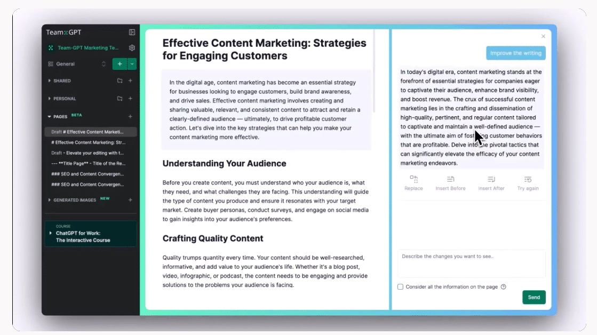

### 功能 2:使用分析

大多数 AI 工具止步于给你一个对话历史。Team-GPT 让你看到团队实际在做什么。你可以看到:

- 哪些提示词用得最多,谁在用
- 不同活动基于模型输出的表现如何
- AI 使用趋势随时间的变化,方便调整团队工作流或培训

营销负责人能快速发现某个团队是否使用不足、内容一致性是否下降,或者某个特定提示词是否带来更好的转化。

如果你想让团队在使用 AI 工具时更高效,不妨试试 👉 [ChatGPT 会员 一个月成品号(质保30天)](https://shaoyumi.com/buy/65),能快速上手,省去不少摸索时间。

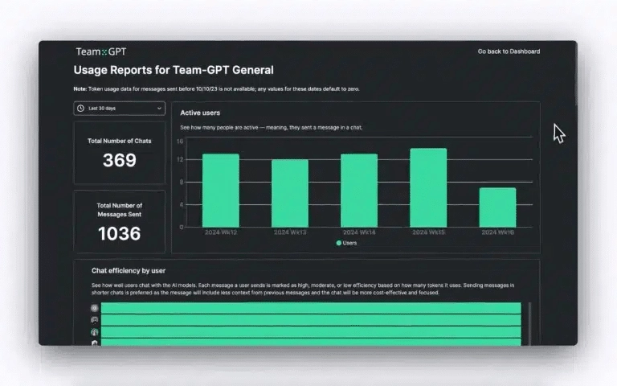

### 功能 3:用 DALL-E 3 生成图片

你可以在写内容的同一个对话里生成图片。不用切换标签页或打断思路。这对以下场景很有用:

- 在活动策划时起草和测试创意方向
- 快速制作博客标题图、广告图或产品视觉
- 在交给设计之前,让文案和创意保持同步

因为都在一个工作空间里,写手和策略师能保持同步,减少来回沟通。

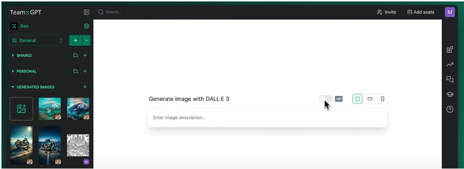

### 功能 4:企业级安全

对于处理敏感活动数据的公司,Team-GPT 支持:

- 私有云或本地部署(你控制数据存储位置)
- 基于角色的权限和隔离工作空间
- 符合全球标准(SOC2、GDPR、ISO 27001)

这让 AI 在处理客户数据、受监管行业或机密活动策划时更安全。

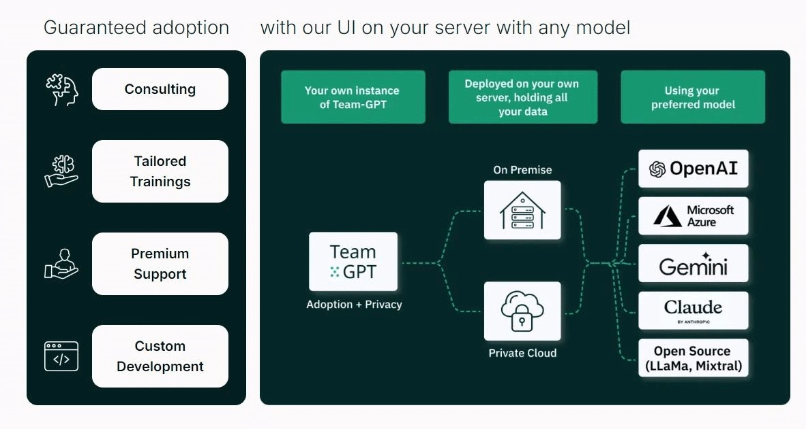

### Team-GPT 适合你,如果你:

✅ 想要结构化的提示词流程和模板,保持活动一致性

✅ 需要使用多个模型,并根据用例灵活切换

✅ 需要团队层面的可见性、分析和内容追踪

✅ 因客户或监管要求需要安全基础设施

### Team-GPT 不适合你,如果你:

❌ 只需要一个简单的基于对话的 AI 工具,配置越少越好

❌ 不在乎分析、定制或工作流控制

❌ 需要原生移动或桌面应用(Team-GPT 仅支持网页版)

---

## ChatGPT Teams 的核心功能

### 功能 1:生成式 AI 能力

ChatGPT Teams 让你在干净、快速的界面里用 GPT-4o。适合:

- 起草博客文章、社媒文案和广告创意
- 改写和总结内容
- 回答研究问题或生成内容大纲

界面简单,即使非技术团队成员也能无需培训直接上手。

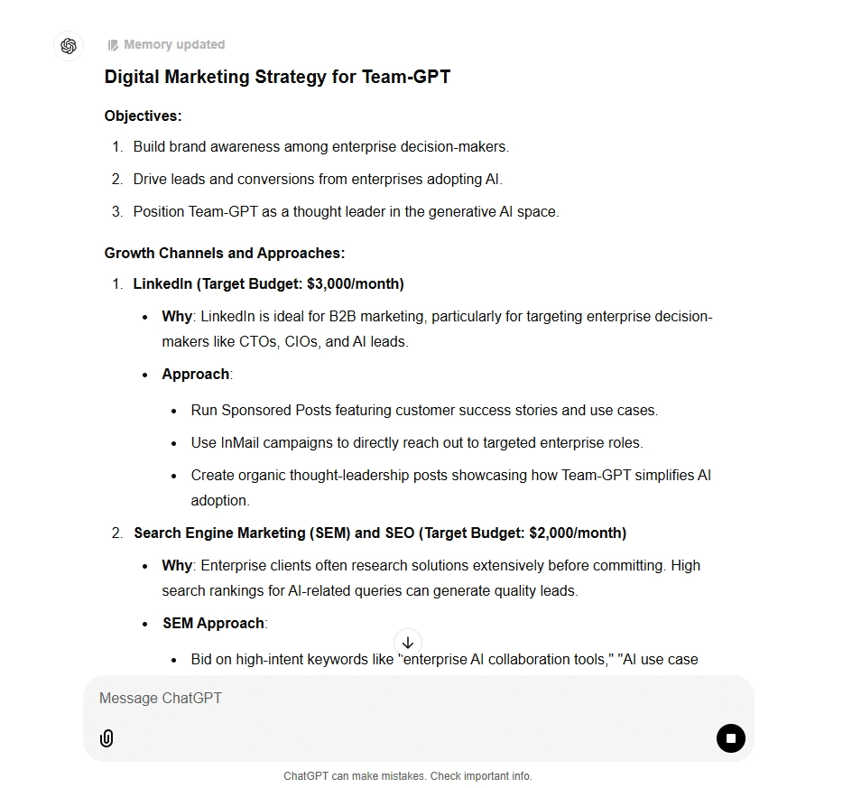

### 功能 2:针对专门用例的 GPTs

通过 GPT Store,你的团队可以安装现成的 GPTs 来帮助处理:

- 总结长文章
- 写邮件主题行
- 为付费广告活动生成创意

你也可以创建自己的 GPTs,但它们在团队层面的定制深度不如 Team-GPT 的共享提示词库。

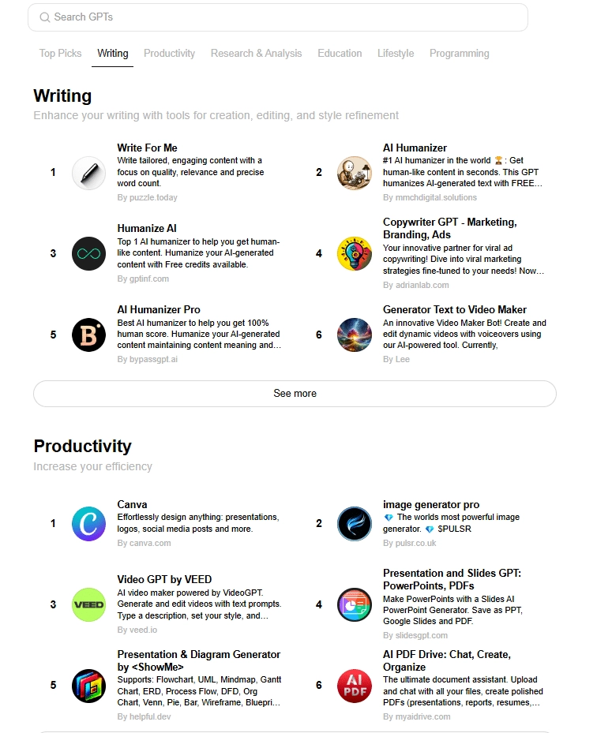

### 功能 3:即时访问网页浏览和文件分析

ChatGPT Teams 包含内置工具,比如深度网页浏览和文件上传,可以帮助团队:

- 分析竞争对手网站或实时拉取最新趋势
- 总结 PDF、幻灯片或活动报告
- 从 CSV、性能数据或简报中提取洞察,无需离开对话

这为从事研究、报告或活动分析的营销人员节省时间,尤其是在速度很重要的时候。

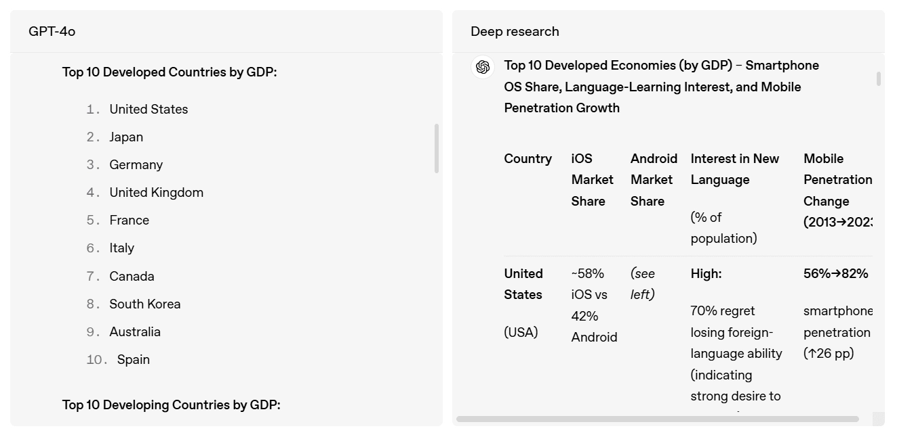

### ChatGPT Teams 适合你,如果你:

✅ 喜欢快速、简单、开箱即用的 AI 工具

✅ 已经在用 OpenAI 工具,想保持在同一系统内

✅ 不需要详细分析、多模型支持或高级工作流

### ChatGPT Teams 不适合你,如果你:

❌ 需要共享提示词库或严格的品牌输出控制

❌ 想尝试不同模型或做 A/B 测试

❌ 需要使用洞察或跨团队的集中内容可见性

**胜者:** Team-GPT 在功能上超越了 ChatGPT Teams,支持多个模型(GPT-4、Claude、Gemini),让你在同一对话里切换。它还提供项目文件夹、提示词构建器、知识库支持和 Fork Chat 用于并行头脑风暴。功能深度让它在真实团队使用中更灵活、更具扩展性。

---

## 团队协作能力对比

两个工具都声称提供团队友好的功能,但协作工具的深度和灵活性差别很大。这里详细对比一下,帮你选择真正适合团队工作方式的工具。

### 快速结论:

- **Team-GPT** 是为实时协作而生的,支持提示词共创、共享工作空间、跨模型访问和结构化团队监督。
- **ChatGPT Teams** 支持共享对话历史和基础文件夹,但缺乏互动协作或跨模型灵活性。

### Team-GPT 的协作功能

Team-GPT 是专门为团队协作设计的。每个功能都是为了帮助团队更快行动、更好协作,并在 AI 项目上保持同步。

以下是它如何支持真正的团队协作,而不仅仅是并行使用:

- **实时提示词共创:** 多个团队成员可以实时在同一个提示词上协作。你能看到变化的发生,就像在 Google Docs 里一样;不用再发截图或把草稿粘贴到 Slack。

- **分叉和对比 AI 响应:** 团队成员可以"分叉"正在进行的对话,探索不同的提示词角度,对比多个 AI 模型的结果,然后在需要时返回原始线程。适合测试创意文案、销售反驳或代码草稿。

- **组织化的知识共享:** 对话、项目和提示词迭代可以分组到文件夹和子文件夹中,方便队友找到过去的工作,从早期实验中学习,避免重复努力。

- **团队监督和学习路径:** 团队管理者可以监控不同成员如何使用 AI,加入线程提供意见,甚至分配 AI 学习路径。

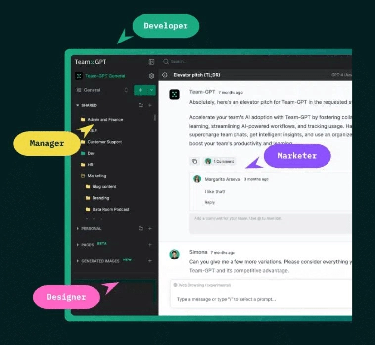

- **同一工作空间内的模型灵活性:** 你的团队不会被限制在一个模型上。你可以使用 GPT-4、Claude、Gemini 或开源模型如 Mistral 和 LLaMa,都在同一个工作空间里。每个团队成员可以为他们的任务选择合适的模型,并并排对比结果。

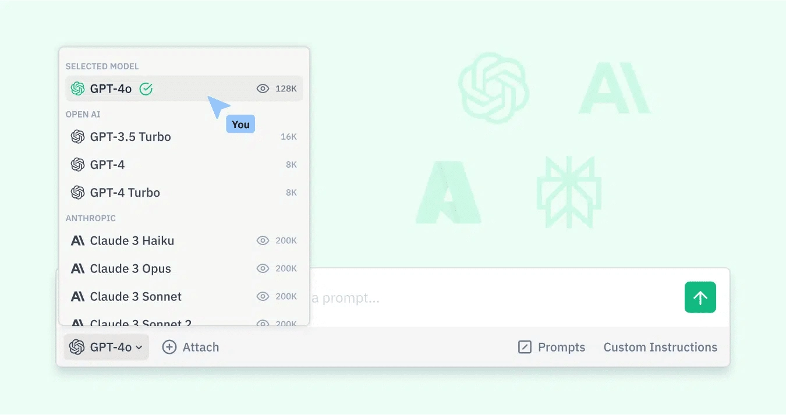

### Team-GPT 适合你,如果你:

✅ 需要团队主动协作提示词,并跨不同 AI 模型测试

✅ 想集中所有 AI 相关的对话、反馈和迭代

✅ 从事共享交付物,如报告、活动、提案或研究

✅ 需要灵活性,在同一工作流中使用多个 AI 提供商

✅ 想通过共享 AI 工作空间记录、入职和培训新员工

### Team-GPT 不适合你,如果你:

❌ 独自工作,不需要共享或组织对话

❌ 只使用一个 AI 模型,不需要高级协作或工作流

❌ 更喜欢最少配置或结构的轻量级工具

---

## ChatGPT Teams 的协作功能

ChatGPT Teams 支持基础协作,但它不是为多用户提示词创建或实时团队协作设计的。大多数协作通过导出或截图在工具外部进行。

以下是它提供的:

- **共享团队工作空间:** 团队可以访问共享对话历史,并将对话保存在文件夹中。你可以查看队友之前与 ChatGPT 的对话,但无法共创提示词或留下内联反馈。

- **自定义 GPT 共享:** 你可以创建并与团队共享自定义 GPTs(针对特定指令或数据微调的 ChatGPT 版本)。这有助于标准化常见用例(如常见问题或入职)的响应。

- **企业控制:** 管理员可以管理用户访问、控制使用策略,并通过仪表板监控采用情况。对治理有用,但对主动协作帮助不大。

- **数据的安全隔离:** 你的对话永远不会被用于训练 OpenAI 的模型,数据保持在组织内隔离。对安全性很好,但对协作用处不大。

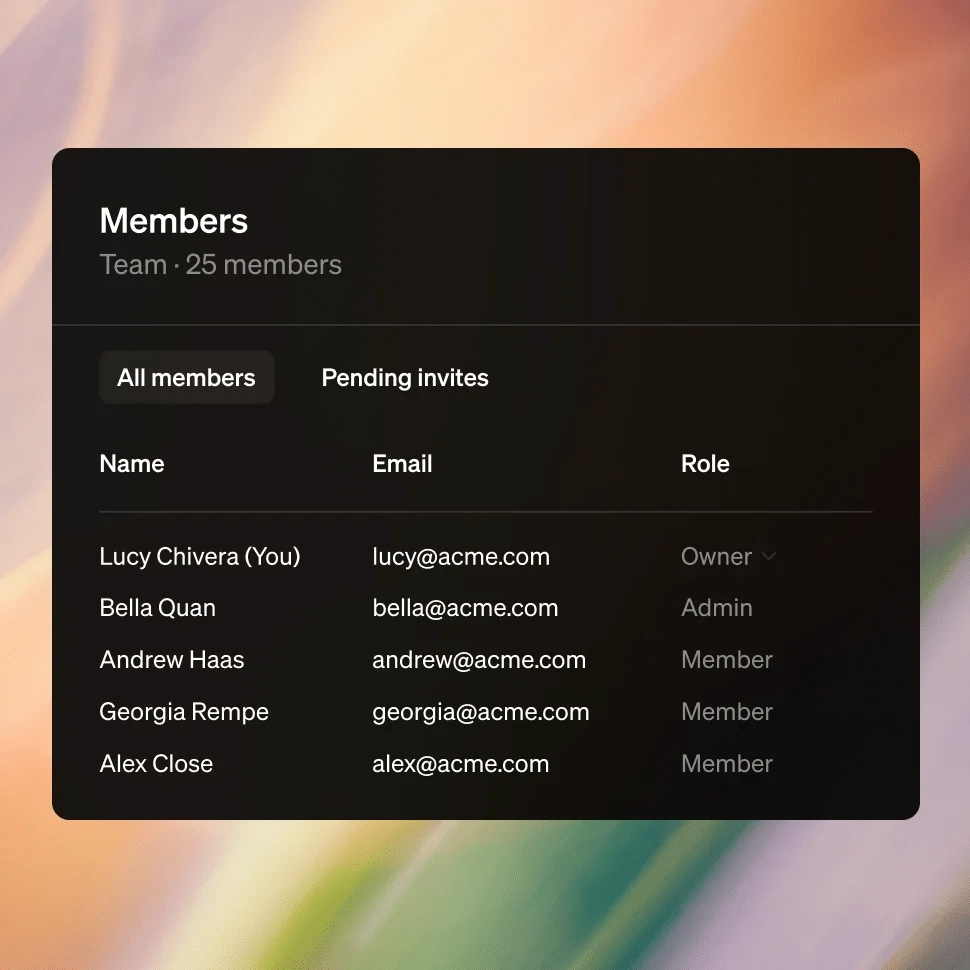

### ChatGPT Teams 适合你,如果你:

✅ 想要一个安全的环境,让员工个人访问 GPT-4

✅ 需要管理员控制和审计跟踪团队如何使用 AI

✅ 依赖内部知识库,想创建可共享的 GPTs

✅ 主要将 ChatGPT 用于独立任务或研究

### ChatGPT Teams 不适合你,如果你:

❌ 需要在对话或提示词内部进行实时协作

❌ 想在单一工作流中使用多个 AI 模型

❌ 需要文件夹、线程和带提示词级反馈的共享空间

❌ 想通过 AI 辅助工作流入职和培训团队成员

**胜者:** 与主要为共享计费方案内的个人用户构建的 ChatGPT Teams 不同,Team-GPT 从头开始就是为协作设计的。共享对话、共享提示词、项目特定文件夹、管理员仪表板和 AI 入职工具,让团队更容易在统一的 AI 工作空间内协作。

---

## 价格对比

两者起步价都是每用户每月 25 美元,但定价扩展方式和每个级别实际提供的内容差异挺大。下面根据团队规模、使用需求和模型偏好进行细分,帮你做更明智的决定。

### 快速结论:

- **Team-GPT** 起价 25 美元/用户/月,可访问 OpenAI、Anthropic、Gemini、DeepSeek 和 Perplexity 等多个模型。更高计划解锁无限使用和 API 灵活性。
- **ChatGPT Teams** 也是 25 美元/用户/月(年付),但限制你只能用 OpenAI 模型。提供企业级安全、工作空间工具和生产力功能,但没有模型多样性或自带 API 密钥选项。

### Team-GPT 定价

Team-GPT 提供三个付费计划供选择:

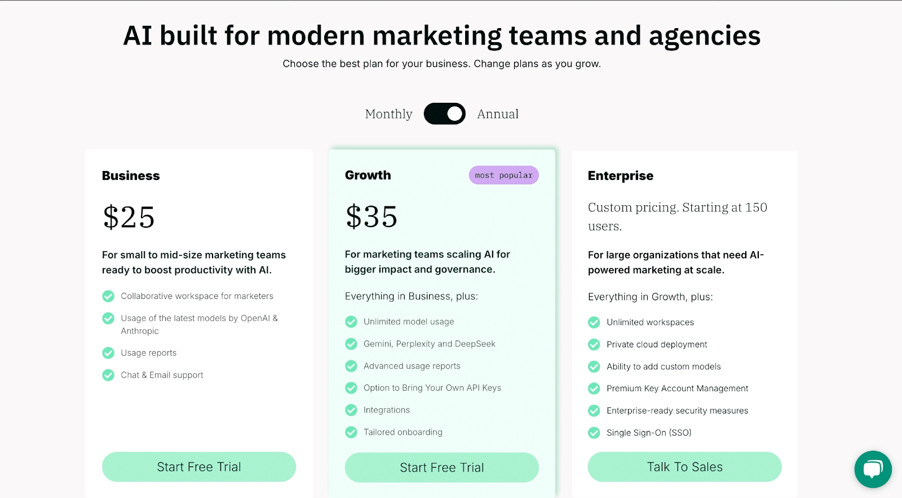

### ChatGPT Teams 定价

ChatGPT Teams 起价 25 美元/用户/月(月付 30 美元/用户/月)。包括:

- GPT-4o 和 GPT-4.1-mini 访问
- Codex 和 ChatGPT 代理用于任务自动化
- 工作空间工具:项目、画布、任务和自定义 GPTs
- 数据连接器(Google Drive、SharePoint、GitHub、Dropbox)
- 企业级安全(SAML SSO、MFA、SOC 2、GDPR/CCPA 合规)
- 默认情况下团队数据不用于训练

![ChatGPT Teams 定价
